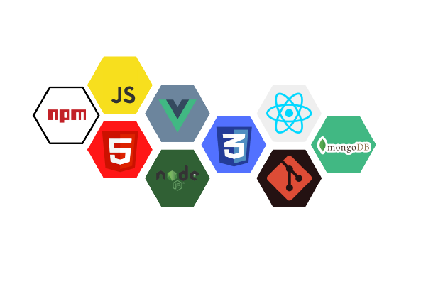

Hello there! 👋🏼
=================

I'm Rizki Nabil Aufa, a Web Developer, Programmer, and A long-life learner.

\- 💻 Interested in Web Development and Data science - 🌱 Currently study Javascript and everything about web development - 🗓️ Goals: make a fullstack web by my self and willing to contribute more in open source projects

My TechStack
============

Let's Connect
-------------

[LinkedIn](www.linkedin.com/in/rizki-nabil-aufa-65297b1a1) [Instagram](https://www.instagram.com/rizkinbil/)  [Twitter](https://twitter.com/rizkinabil_)  [My Portofolio](https://rizkinabil.github.io/)

[@import url('https://fonts.googleapis.com/css2?family=Bebas+Neue&family=Heebo&display=swap'); \*{ margin: 0; box-sizing: border-box; padding: 0; } /\* .wrapper{ background-color: white }, \*/ h1{ font-family: "Bebas Neue", cursive; text-align: center; } h2{ font-family: "Bebas Neue", cursive; } p{ font-family: "Heebo", sans-serif; font-weight: 400; } .techstack{ margin-top: 20px } .contact-parent{ justify-content: space-around }](https://rizkinabil.github.io/)